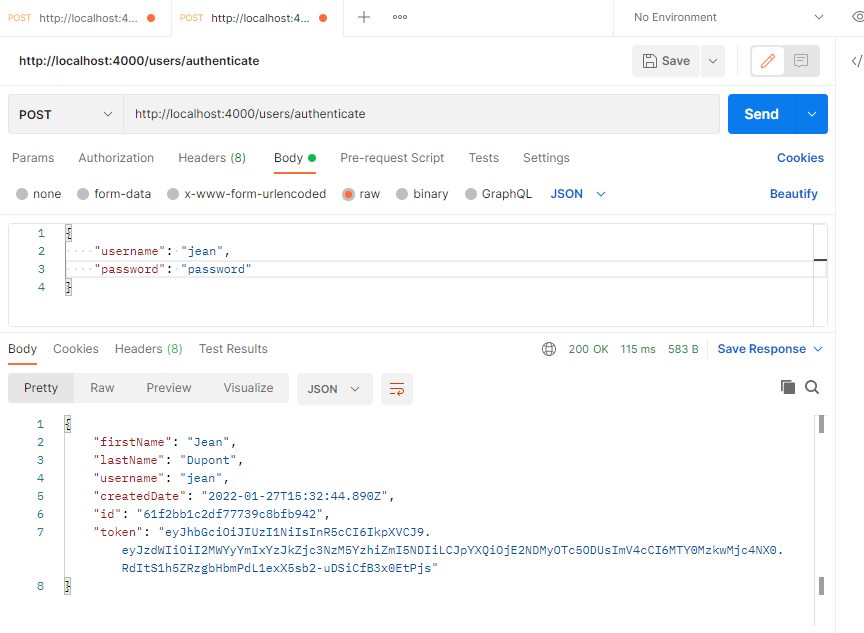

# Api pour l'application de boissons
***
Cette API a été développée pour permettre à un utilisateur de commander un boisson à partir d'une liste et  la gestion de ces boissons.

### Rappels
***
- NodeJS + MonoDB API utilisés pour la gestion des utilisateurs, l'authentification et l'inscription.

## Installation
***
- Installer Node.js : https://nodejs.org/en/
- Installer MonoDB (Version Community Server) : https://www.mongodb.com/try/download/community
  - Si des problèmes persistent lors de l'installation de MonoDB, voir la documentation de l'installation : https://docs.mongodb.com/manual/administration/install-community/
- Installer Postman : https://www.postman.com/downloads/
- Installer Git : https://git-scm.com/downloads

Lien GitHub : https://github.com/cramekiller/qlog

- Cloner le projet dans un dossier local à votre PC avec la commande ```git clone https://github.com/cramekiller/qlog```.
- Déplacez vous dans le dossier local où vous le projet à été cloné et installer les dépendances nécessaires au projet avec ```npm install``` puis ```npm i mocha --global```
- Lancez l'API avec la commande ```npm start```.
- Vous aurez un serveur qui écoute sur le port 4000.

### Tester l'installation avec Postman
***
- Dans Postman, pour enregistrer un utilisateur :
  - ouvrez un nouvel onglet
  - request method = POST
  - request URL = http://localhost:4000/users/register
  - Sélectionner "Body" en dessous de "request URL", puis "raw" et "JSON"
  - Entrer la commande:
```
{
  "firstName": "Jean",
  "lastName": "Dupont",
  "username": "jean",
  "password": "password"
}
```


### Authentifier un utilisateur et récupérer le token JWT
***
- Dans postman :
  - Ouvrez un nouvel onglet
  - request method = POST
  - request URL = http://localhost:4000/users/authenticate
  - Selectionner "Body" -> "raw" -> "JSON"
  - Entrer la commande:
```
{
    "username": "jean",
    "password": "password"
}
```




## Endpoints disponibles pour l'utilisateur
***
```
- /getBoissons 
- /commander
- /valider/:id
- /annuler/:id
```

## Exemples d'endpoints pour gérer le distribiteur
***

- Ajouter un ingrédient


- Afficher tous les ingrédients


- Ajouter une boisson


- Afficher les boisson


- Ajouter des gobelets


- Afficher les gobelets

